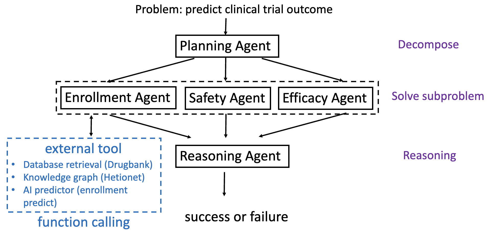

# ClinicalAgent

[](https://arxiv.org/abs/2404.14777)

Clinical Agent is an advanced framework leveraging Large Language Models (LLMs) to enhance the efficiency and effectiveness of clinical trials.

## Overview



## Directory Structure

```
ClinicalAgent/
├── algo/
│   ├── agents/
│   │   ├── tools/
│   │   │   ├── drugbank/
│   │   │   ├── enrollment/
│   │   │   ├── hetionet/
│   │   │   ├── risk_model/
│   ├── main.ipynb
├── web/
```

- **/algo**: Contains the core codebase for ClinicalAgent.
- **/web**: A preliminary web tool for ClinicalAgent based on LLM.

## Setup Instructions

### Setting the OpenAI API Key

Before starting, set your OpenAI API key by adding the following lines to your `~/.bashrc` file:

```sh
export OPENAI_API_KEY="sk-xxxxxxxxx"
export NEXT_PUBLIC_OPENAI_API_KEY="sk-xxxxxxxxx"
```

### Dependencies

Ensure you have Python 3.8.19 installed. The `algo` directory requires the following dependencies:

- `pytorch==1.12.1`
- `torchvision==0.13.1`
- `torchaudio==0.12.1`
- `cudatoolkit==11.3`
- `transformers==4.39.3`
- `tokenizers==0.15.1`
- `openai==1.28.0`

To set up the environment, run:

```sh
python3.8 -m venv venv
source venv/bin/activate
pip install torch==1.12.1 torchvision==0.13.1 torchaudio==0.12.1 cudatoolkit==11.3 transformers==4.39.3 tokenizers==0.15.1 openai==1.28.0
```

### Agents and Tools

Before running ClinicalAgent, follow the README instructions in the `drugbank`, `enrollment`, `hetionet`, and `risk_model` directories to generate the necessary data for the tools:

- [drugbank](https://github.com/LeoYML/ClinicalAgent/tree/main/algo/agents/tools/drugbank)
- [enrollment](https://github.com/LeoYML/ClinicalAgent/tree/main/algo/agents/tools/enrollment)
- [hetionet](https://github.com/LeoYML/ClinicalAgent/tree/main/algo/agents/tools/hetionet)
- [risk_model](https://github.com/LeoYML/ClinicalAgent/tree/main/algo/agents/tools/risk_model)

## Running ClinicalAgent

The primary entry point for running ClinicalAgent is the `main.ipynb` notebook. This notebook utilizes various agents located in the `algo/agents` directory.

In `main.ipynb`, you can switch between using agents and tools or just plain GPT for answering questions by calling `solve_problem()` or `solve_problem_standard()`, as shown below:

```python
subproblem_solve, final_result_str = solve_problem(user_problem)
```

```python
subproblem_solve, final_result_str = solve_problem_standard(user_problem)
```

## Citation

If you use ClinicalAgent in your research, please cite the following paper:

```
@misc{yue2024clinicalagentclinicaltrialmultiagent,
      title={ClinicalAgent: Clinical Trial Multi-Agent System with Large Language Model-based Reasoning}, 
      author={Ling Yue and Sixue Xing and Jintai Chen and Tianfan Fu},
      year={2024},
      eprint={2404.14777},
      archivePrefix={arXiv},
      primaryClass={cs.CL},
      url={https://arxiv.org/abs/2404.14777}, 
}
```

---

Feel free to reach out if you have any questions or need further assistance.
